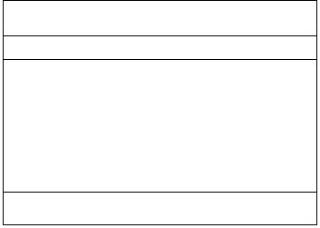
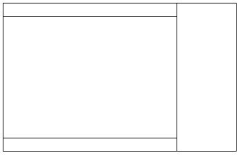

## Layout


### Installation
to install layout component use this command:
```powershell
  npm i @ReactSeam/layout
```
### Usage
```javascript
    import {LayoutNCHBF} from '@ReactSeam/layout';
    [OR]
    import {LayoutHNCBF} from '@ReactSeam/layout';
```
There are two types of Layout 




you can choose between them

### examples
```javascript
    		<LayoutNCHBFDemo header={<h5>Header</h5>}
    		nav={
    			<ul>
    				<li>link1</li>
    				<li>link2</li>
    				<li>link3</li>
    				<li>link4</li>
    			</ul>
    		}
    		footer={<h5>Footer</h5>}
    		bodyMinWidth={50} navMinWidth={5} navWidth={15} isPercentage={true}>
    			Test
    		</LayoutNCHBFDemo>
    		}
```
```javascript
    		<LayoutNCHBF header={<h5>Header</h5>}
    		nav={
    			<ul>
    				<li>link1</li>
    				<li>link2</li>
    				<li>link3</li>
    				<li>link4</li>
    			</ul>
    		}
    		footer={<h5>Footer</h5>}
    		bodyMinWidth={50} navMinWidth={5} navWidth={15} isPercentage={true}>
    			Test
    		</LayoutNCHBF>
```
### API
### Demo

### Archive
- [version 0.1.0](./CHANGELOG.md#0.1.0)


